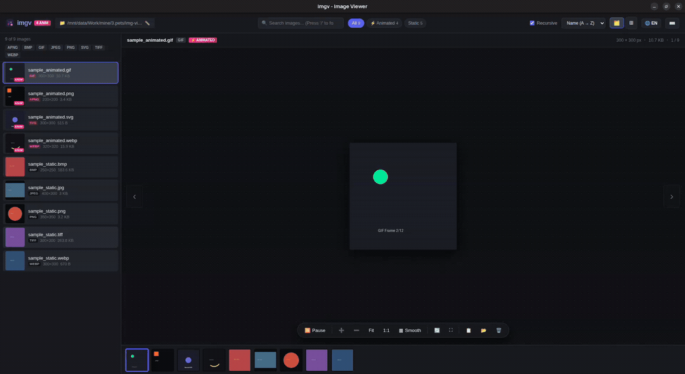

# imgv - High-Performance Image Viewer & Animation Player

> [!NOTE]
> **Disclaimer**: This codebase and project were generated with the assistance of Artificial Intelligence (AI). While designed with production-grade engineering principles, performance optimizations, and thorough testing, please review and use it according to your needs.

[](https://golang.org)
[](https://github.com)
[](LICENSE)

**imgv** is a blazingly fast, lightweight, and modern desktop image viewer written in **Go** and vanilla web technologies. It is built specifically to handle massive directories (tens of thousands of images) with near-instant startup, smooth 60fps virtual scrolling, full animated image playback, and specialized pixel art nearest-neighbor rendering.

---

## 📸 Preview & Demo


*Interactive Demo: High-speed directory browsing, instant animated playback, split & grid layout switching, and pixel-perfect inspection.*

---

## ✨ Key Features

### 🎬 Complete Animated Image Support
- **Full Formats Supported**: GIF, Animated WebP, APNG (Animated PNG), Animated SVG, Animated AVIF.
- **Static Formats Supported**: PNG, JPEG/JPG, WebP, SVG, BMP, ICO, AVIF, TIFF/TIF (automatic on-the-fly conversion).
- **Interactive Frame Control**: Play and pause animations on the fly. Freezes animated frames onto an HTML5 canvas with a single tap of `Space`.

### 👾 Nearest-Neighbor Pixel Art Inspection
- **Crisp Nearest-Neighbor Rendering**: Built for game designers, pixel artists, and icon developers. Prevents browser blur and antialiasing on tiny 8x8, 16x16, or 32x32 sprites.
- **Deep Zoom Capability**: Smooth cursor-anchored zoom up to **50x (5000%)** magnification.
- **Instant Mode Switching**: Toggle between *Smooth (Bilinear)* and *Pixelated (Nearest Neighbor)* via toolbar or the `P` key.

### ⚡ Extreme Performance for Massive Folders
- **Zero-Stat Directory Traversal**: Leverages Go's `filepath.WalkDir` with bounded worker pools to scan 50,000+ files in fractions of a second.
- **Smart Animation Probing**: Detects static formats instantly by extension without disk I/O, inspecting binary chunks only for ambiguous formats.
- **Infinite Virtual Scrolling**: Only renders visible DOM nodes (~20 items) regardless of folder size. Consumes minimal memory and guarantees smooth scrolling.
- **Chunked Infinite Grid**: Loads large photo libraries progressively without freezing the browser thread.

### 🖥️ Native Desktop Experience & Context Menu
- **Standalone App Window**: Runs in a clean, frameless Chromium application window without address bars or tabs.
- **Smart Background Daemon**: Launches the GUI and instantly frees your terminal prompt. Terminates automatically when the window is closed.
- **Rich Context Menu**:
  - 📂 **Reveal in File Manager**: Opens folder and highlights the file in OS file explorer.
  - 🚀 **Open in Default App**: Launches your system default graphics program.
  - 📋 **Copy to Clipboard**: Copies decoded raw image bytes directly to clipboard (for pasting in Discord, Photoshop, etc.).
  - 🔗 **Copy File Path**: Copies absolute filesystem paths.
  - ℹ️ **Image Properties**: Inspect file size, dimensions, megapixels, aspect ratio, and modified dates.
  - 🗑️ **Delete Image**: Safely trashes files with confirmation dialogs.

### 🌐 Multi-Language Localization
- Complete native support for **English** and **Vietnamese (Tiếng Việt)**, switchable dynamically with saved user preferences.

---

## ⌨️ Keyboard Shortcuts

| Shortcut | Action |
| :--- | :--- |
| `→` / `D` / `J` | Next image |
| `←` / `A` / `K` | Previous image |
| `Space` | Play / Pause animated image |
| `Enter` | Open selected image in Split View (from Grid View) |
| `P` | Toggle Nearest Neighbor (Pixel Art) vs Smooth filtering |
| `0` | Fit image to viewport |
| `1` | Zoom to actual size (1:1 / 100%) |
| `+` / `-` | Zoom in / Zoom out (or Mouse Wheel) |
| `R` | Rotate 90 degrees clockwise |
| `F` | Toggle fullscreen mode |
| `C` | Copy full file path to clipboard |
| `/` | Focus search filter input |
| `Delete` | Delete current image |
| `Esc` | Close modal / exit fullscreen / dismiss menu |
| `?` | Show keyboard shortcuts modal |

---

## 🚀 Installation & Build

`imgv` is distributed as a **single standalone executable** with all web assets, icons, and styling embedded via Go `embed.FS`. No external dependencies or runtime node modules are needed.

### Prerequisites
- Go 1.21 or higher installed on your machine.
- Linux, macOS, or Windows.

### One-Click Installation (Linux)

Install `imgv` along with all desktop icons, app launcher integration, and file associations with a single command:

```bash
# Clone the repository
git clone https://github.com/your-username/img-viewer.git
cd img-viewer

# Install for current user (no sudo required)
./install.sh

# Or install system-wide (requires sudo)
sudo ./install.sh
```

To uninstall at any time:
```bash
./install.sh --uninstall
```

---

## 💻 CLI Usage

Running `imgv` opens the application window immediately and returns the shell prompt so you can continue your terminal workflow.

```bash
# View all images recursively in current working directory
imgv .

# Open a specific folder
imgv ~/Pictures
imgv /path/to/assets

# Flat mode: Scan only top-level directory (no subfolders)
imgv --flat ~/Downloads
# Or:
imgv --no-recursive ~/Downloads

# Run in foreground (attaches logs directly to terminal)
imgv -f .

# Start as a local HTTP web server on a fixed port without opening browser
imgv -p 8080 --no-open /srv/photos

# Specify initial language ('en' or 'vi')
imgv --lang vi ~/Pictures

# View help and all flags
imgv --help
```

---

## 🛠️ CLI Options Reference

| Flag | Description |
| :--- | :--- |
| `[DIRECTORY]` | Target directory containing images (default: `.`) |
| `-f`, `--foreground` | Run attached to console without detaching to background |
| `--flat`, `--no-recursive` | Scan only top-level files without descending into subfolders |
| `-p`, `--port <port>` | Bind server to a specific TCP port (default: auto-assign free port) |
| `--no-open` | Start server without launching the desktop window |
| `--no-app` | Open in default browser tab instead of standalone app window |
| `--lang <en\|vi>` | Set initial interface language (`en` or `vi`, default: `en`) |
| `-v`, `--version` | Display version information |
| `-h`, `--help` | Display command-line usage help |

---

## 🏗️ Architecture & Technical Design

`imgv` is architected for maximum speed and minimal resource usage:

```
┌─────────────────────────────────────────────────────────────┐
│                       imgv Architecture                     │
├──────────────────────────────┬──────────────────────────────┤
│       Go Backend Core        │      Frontend Interface      │
├──────────────────────────────┼──────────────────────────────┤
│ • Scanner: WalkDir + Pool    │ • Vanilla JS (Zero Framework)│
│ • Zero I/O Animation Checker │ • Virtual Scrolling (60 FPS) │
│ • On-the-Fly Image Decoders  │ • CSS Transform Pan & Zoom   │
│ • Keep-Alive Heartbeat / Auto│ • Nearest-Neighbor Rendering │
│ • Embedded FS Assets (go:embed) • Chunked Responsive Grid   │
└──────────────────────────────┴──────────────────────────────┘
```

- **Backend**: Built with standard Go packages, high-concurrency channel pipelines, and zero bloated CGO dependencies.
- **Frontend**: 100% vanilla JavaScript and CSS3. Avoids bulky virtual DOM frameworks to keep DOM allocations minimal and instantaneous.
- **Process Lifecycle**: The backend server keeps an active heartbeat with the browser client. Closing the window instantly triggers safe server shutdown and cleans up temporary browser profiles.

---

## 📄 License

This project is licensed under the [MIT License](LICENSE).
